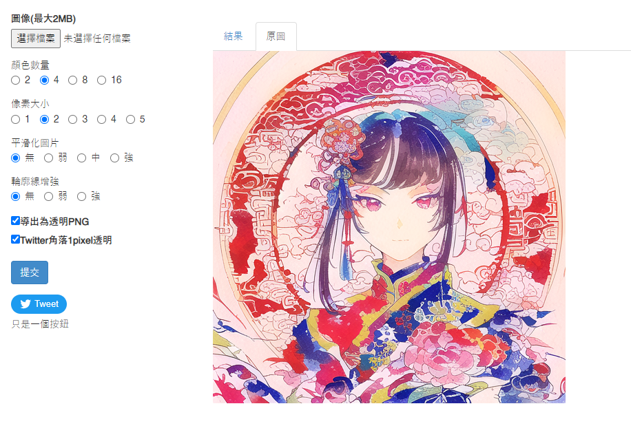
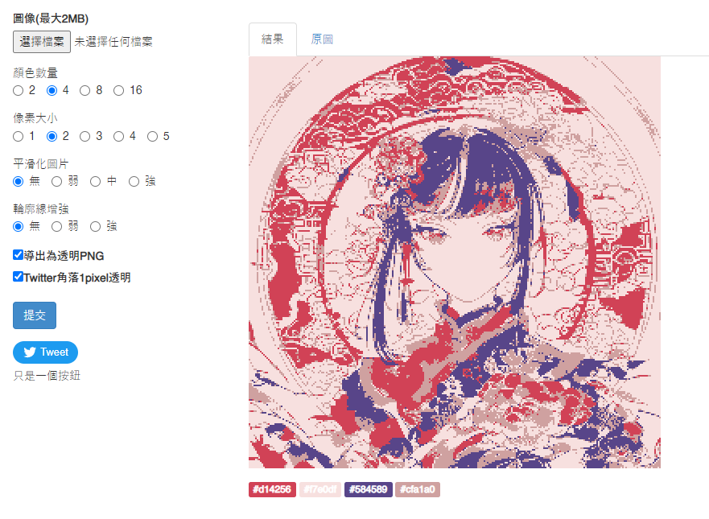
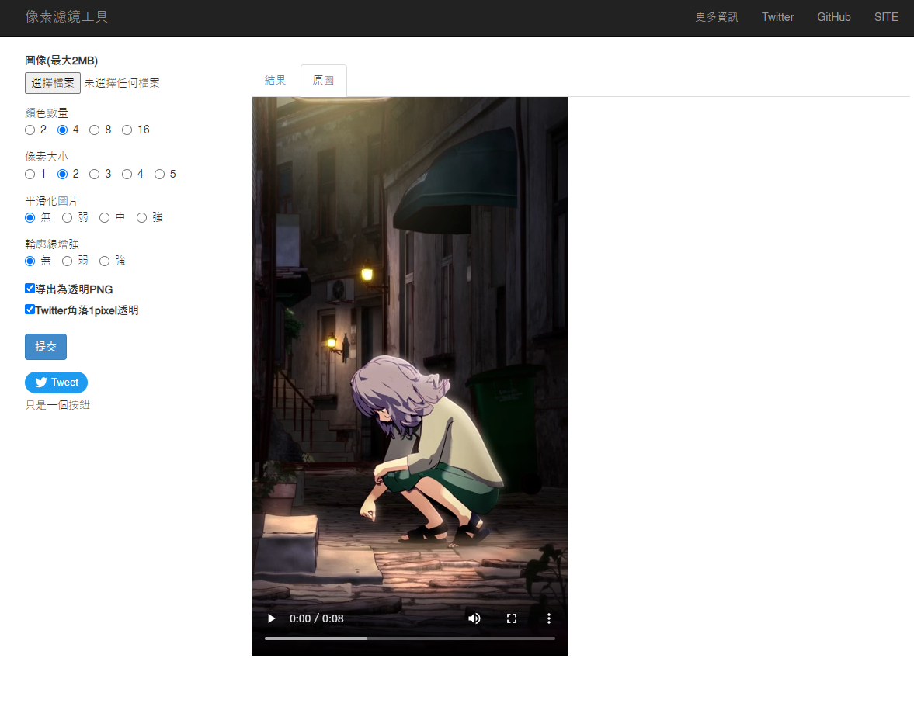

# Pixel-Art-Filter-Web
English | [繁體中文](README_TCH.md)

A web version pixel art filter can render image, gif and video.

web version of my [pixel art filter tool](https://github.com/JingShing-Tools/Pixel-Art-transform-in-python).

This tool can render image, gif and video into pixel art style.

# [My Pixel Art Filter Website](https://pixel.jingshing.com/english) is online now
You can [click this to enter my Pixel Art Filter Website](https://pixel.jingshing.com/english).

## Usage
If you want to install modules enter this command: ```pip install -r requirements.txt```
> module you need(If you can't install requirement.txt):
>
> Flask
>
> numpy
>
> opencv-python
>
> Pillow
>
> tqdm

If you want to use please active: ```script/pixel_page.py```

And then open: ```http://127.0.0.1:5000/```

If you want to use gunicorn on Linux:
> Install gunicorn using this command: ```pip install gunicorn```
> If you want to use gunicorn on your device.
> 
> Way 1
> 
> Please input this command: ```gunicorn --workers=4 -b 0.0.0.0:5000 pixel_page:app --daemon```
> 
> --worker=amount // suggested 1 core 2-4 worker
> 
> --daemon // can make gunicorn working in background
> 
> Way 2
> 
> use this command: ```gunicorn --config=gunicorn.config.py pixel_page:app``` or ```gunicorn -c gunicorn.config.py pixel_page:app```

<details>
<summary>If you can't do video edit on Linux(Fixed H264 encode problem)</summary>
Because it need to use H264 to encode video to display video on web browser. And Linux didn't have H264. Because Opencv can't release H264 encode tool. You need to compile a opencv by yourself.

> I will use ubuntu for example below. To teach how to compile a ver that can use H254.
* If you want to compile it by yourself：

  * Install compile tool and module you need
 
    ```
    sudo apt install build-essential cmake git pkg-config libgtk-3-dev \
        libavcodec-dev libavformat-dev libswscale-dev libv4l-dev \
        libxvidcore-dev libx264-dev libjpeg-dev libpng-dev libtiff-dev \
        gfortran openexr libatlas-base-dev python3-dev python3-numpy \
        libtbb2 libtbb-dev libopenexr-dev \
        libgstreamer-plugins-base1.0-dev libgstreamer1.0-dev
    ```
    
  * git clone opencv and opencv contrib
  
    ```php
    mkdir ~/opencv_build && cd ~/opencv_build
    git clone https://github.com/opencv/opencv.git
    git clone https://github.com/opencv/opencv_contrib.git
    ```
    
  * CMake set OpenCV construct
 
    ```jsx
    cmake -D CMAKE_BUILD_TYPE=RELEASE \
        -D CMAKE_INSTALL_PREFIX=/usr/local \
        -D INSTALL_C_EXAMPLES=ON \
        -D INSTALL_PYTHON_EXAMPLES=ON \
        -D OPENCV_GENERATE_PKGCONFIG=ON \
        -D OPENCV_EXTRA_MODULES_PATH=~/opencv_build/opencv_contrib/modules \
        -D BUILD_EXAMPLES=ON ..
    ```
  
  * If you success it will show the message below
  
    ```bash
    -- Configuring done
    -- Generating done
    -- Build files have been written to: /home/vagrant/opencv_build/opencv/build
    ```
  
  * Compile(-j for speeding compiling. number after j is your cpu core)
  
    ```go
    make -j4
    ```
  
  * Installing the module you compiled
  
    ```go
    sudo make install
    ```
  
  * Check version
  
    ```undefined
    pkg-config --modversion opencv4
    ```
  
  * Or using python Import to check version
  
    ```swift
    python3 -c "import cv2; print(cv2.__version__)"
    ```

</details>


You can click pic below to [watch vid](https://youtu.be/HpTbwjZv2y0).
[](https://youtu.be/HpTbwjZv2y0)

# UI

## Image edit on web
### Before

### After


## Video edit on web
### Before

### After


## Video supported now
You can click the image below to watch [the video](https://youtu.be/W8HxlqgLQnQ).

[](https://youtu.be/W8HxlqgLQnQ)

## GIF supported now
* 
* 

## Original image


## Effect 16bit

## Effect 4bit

## Effect 2bit

<details>
<summary>Update Log</summary>

## Ver 1.0

* Released exe
* Feature
  * Color num
  * Pixel size
  * Smoothing
  * Outline
  * Dithering

## Ver 1.1

* Add Chinese text
* Add compression
* Feature
  * Add Saturation
  * Add Contrast
  * Add brightness

## Ver 1.2

* Add more option of color nums, contrast and saturation values

## Ver 1.2.1

* Add maker name

## Ver 1.3

* Add page system
* Add mode switch
* Add custom mode -> can edit value you want

## Ver1.4

* Improved dithering effect. Removed noise points.

## Ver1.5

* Add gif module.
* If file is gif it will be gif mode. It will automatic save as gif when transform is done.
* Now supported gif.

## Ver1.6

* Working on Video module -> can edit mp4 and avi with experiment module.
  * flv file save has some bug.
  * This module will eat most of your cpu. So i will wrapped it as another tool.
* Found bug can't save as chinese character name file.
* [video module](https://github.com/JingShing/Opencv-Video-edit-module)

## Ver1.6.1

* GIF

  * Fixed gif duration error.

  * now can support ".gif "  and " .GIF "

* Video

  * Try to add video module in pixel art filter.
  * It's an experimental area. Use it wisely and trust your computer.
  * Now can transform video but there are some rules and thing you should know:
    * If it start it won't stop and cannot pause so you need to use it wisely.
    * It will take more time and ate almost your cpu when you use setting that are complex.
    * If it done video cover will display on window. And it will automatically save at the folder you put the exe.
    * Edited video will lost sound and become ultimately large. So be careful.
  * I add cmd for process hint. It will be there until I removed video edit part.

## Ver1.6.2

* Add save success hint
* Found gif convert bug. Fixed.
* Add tqdm as process bar in cmd.
  * Add process bar on both gif and video part in cmd.
* Add video rendering window.
  * You can press 'Q' to stop rendering video now

## Ver1.6.3

* Windows size will limit in a scope. -> it will be limited in 800 X 600

## Ver1.6.4

* Add gif rendering display window
* can stop render while rendering gif by pressing 'Q'

## Ver1.7

* Add mouse control:
  * Use scroll up to scale up
  * Use scroll down to scale down
  * Use mouse mid button to make image back to original pos and scale rate
  * Can drag image now by left click and moving mouse
* Add dict to save sets to make code more flexible.

## Ver1.7.1

* Improved scaled image resolution
* Can import and save sets. But mode should be same as saved set.

## Usage
You can click pic to watch vid.
[](https://youtu.be/HpTbwjZv2y0)

## Video supported now
[](https://youtu.be/W8HxlqgLQnQ)

## GIF supported now
* 
* 

## Original image


## Effect 16bit

## Effect 4bit

## Effect 2bit

 
 ## Ver1.8
 * Create Web version
 * Now can edit it on web
 ## Ver1.8.1
 * Added Gif web edit feature
 ## ver1.8.2
 * Added H264 to video edit to make web browser can play video successfully
 ## ver1.8.3
 * Now can remember last file you select.
 * Now can alert wrong file format.
 ## ver1.8.4
 * Add contrast edit.
 * Add saturation edit.
 ## ver1.8.5
 * Add English and Traditional Chinese can select from right upper corner.
 * Page will remember what last language you choose.
 ## ver1.8.6
 * Add uploaded file preview. It can show you file name, file size and display preview.
 * 
</details>

<details>
<summary>To do list</summary>

- [ ] QR code feature
- [ ] Remember set
- [ ] Multi language support
- [ ] Custom Mode
- [ ] Mouse on reference will show hint
- [ ] kuwahara filter(Oil painting style)
- [ ] Dark mode
- [ ] Add hash detect
 
## Done
- [X] Same image recycle

</details>
