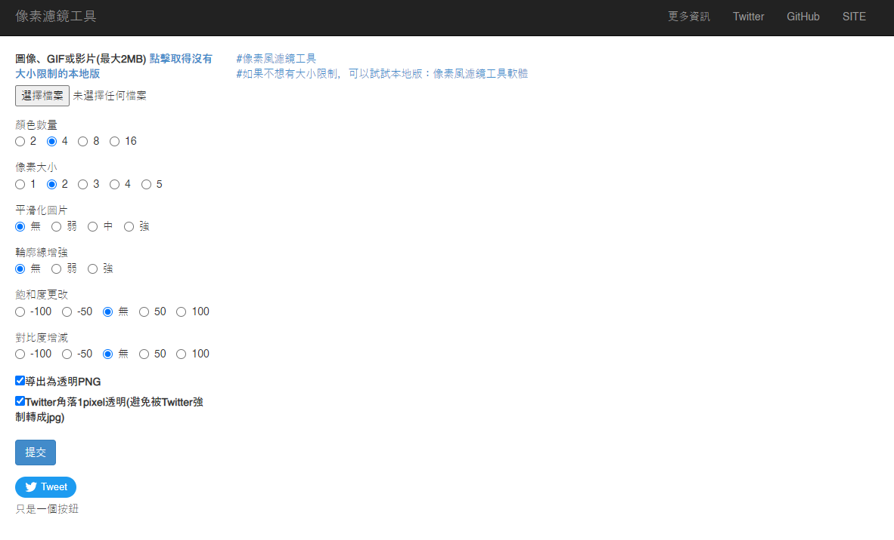
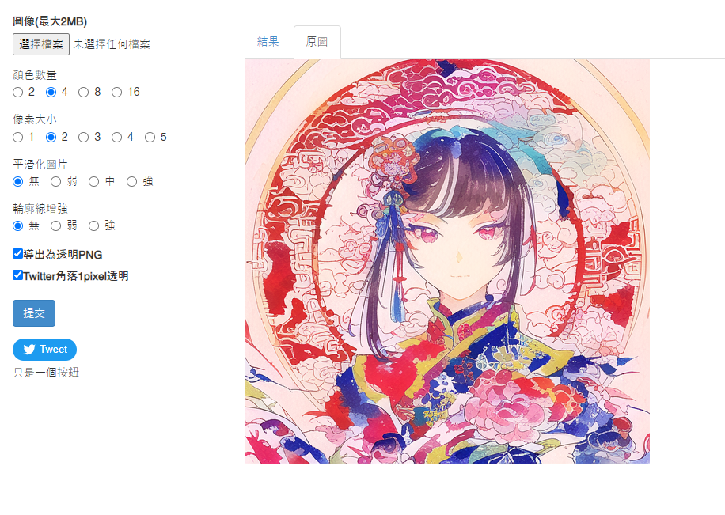
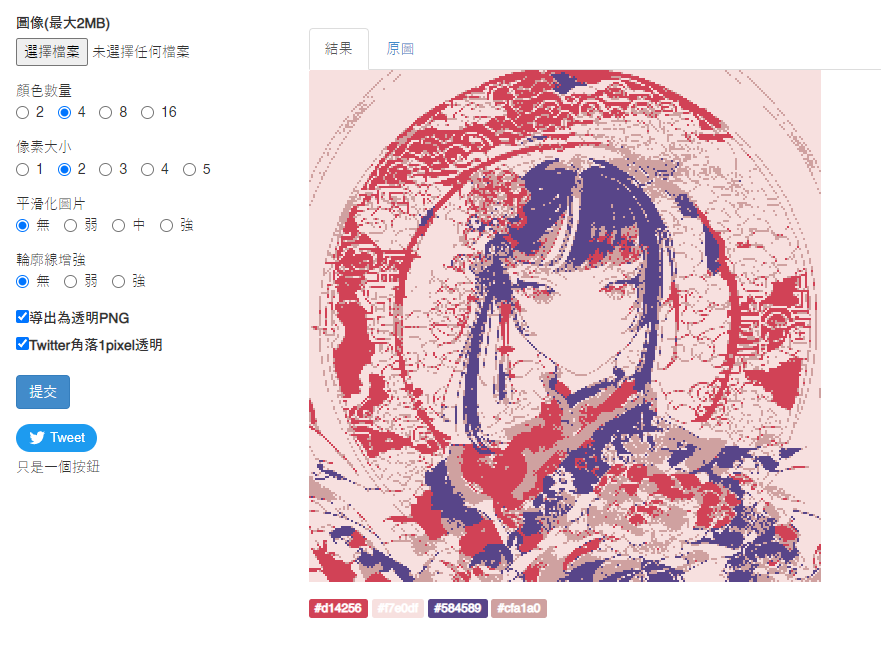
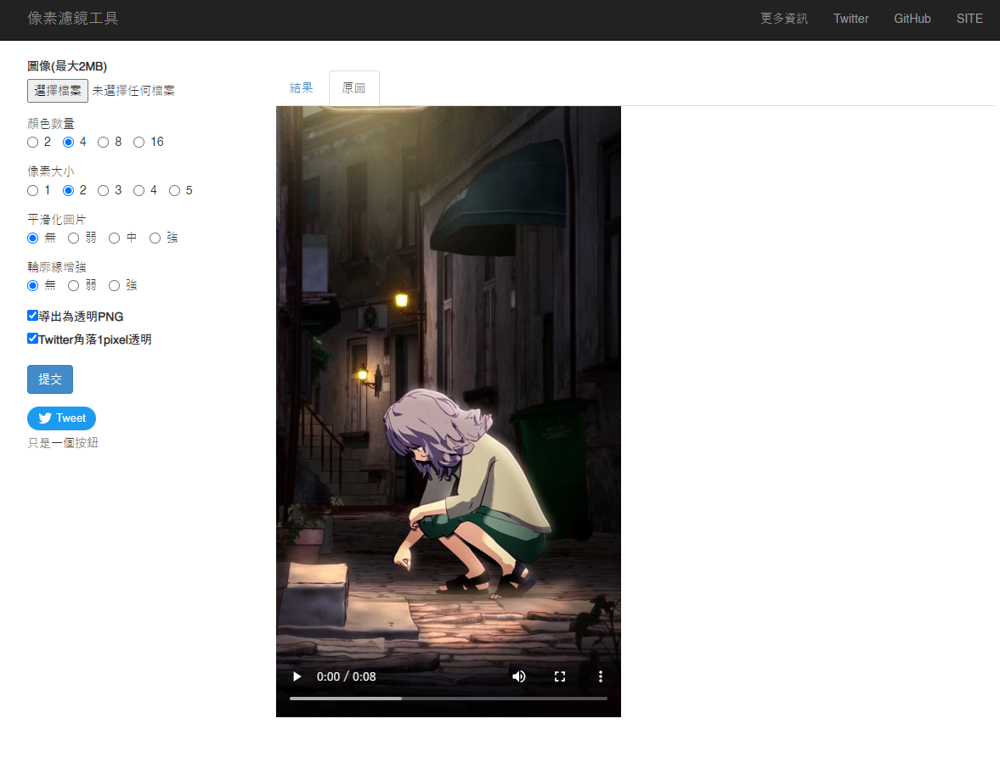
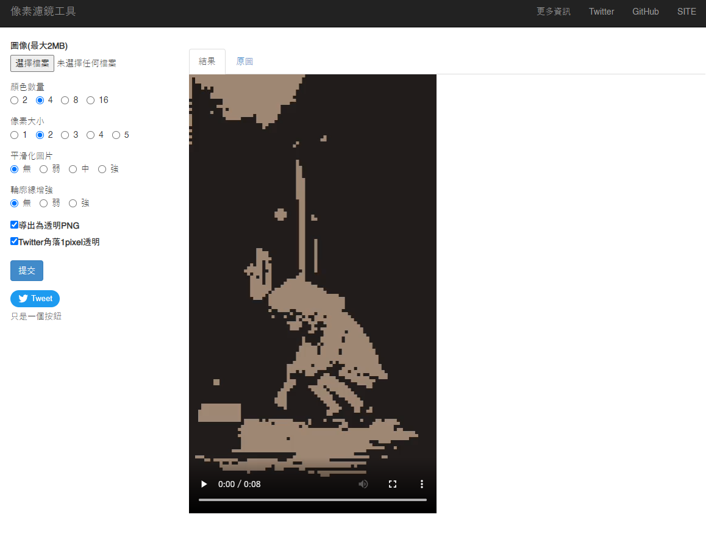
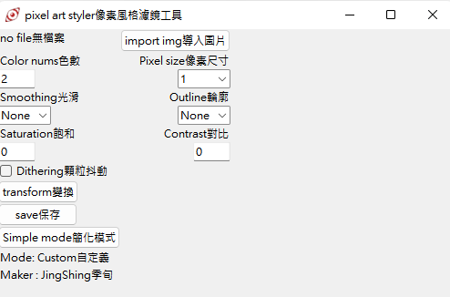
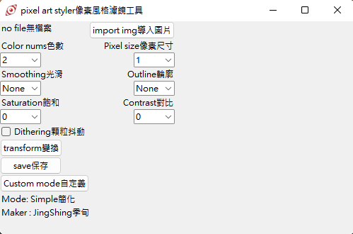
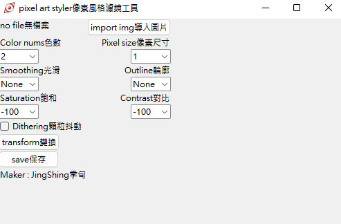

# Pixel-Art-Filter-Web
[English](README.md) | 繁體中文

一個網路版的像素化工具。可以渲染圖片、GIF和影片。

我的 [像素化濾鏡工具](https://github.com/JingShing-Tools/Pixel-Art-transform-in-python) 的網路版。

# [我的像素畫風濾鏡網站](https://pixel.jingshing.com/) 已經上線啦
你可以 [點擊這個連結進入我的像素畫風濾鏡的網站](https://pixel.jingshing.com/)。

## Usage用法
~~如果需要安裝套件，可以使用這個指令 : ```pip install -r requirements.txt```.~~
> 需要的模塊:
>
> Flask
>
> numpy
>
> opencv-python
>
> Pillow
>
> tqdm

如果想要使用，請啟動： ```script/pixel_page.py```

然後開啟這個網址： ```http://127.0.0.1:5000/```

如果想在 Linux 上使用 gunicorn:
> 使用這個指令安裝 gunicorn : ```pip install gunicorn```
> 以下有兩種方式以 gunicon 啟動這個腳本
>
> 方法 1
>
> 使用這個指令: ```gunicorn --workers=4 -b 0.0.0.0:5000 pixel_page:app --daemon```
>
> --worker=amount // 建議 1 核 2-4 worker
>
> --daemon // 可以讓 gunicorn 在後台工作
>
> 方法 2
>
> 使用這個指令: ```gunicorn --config=gunicorn.config.py pixel_page:app``` 或 ```gunicorn -c gunicorn.config.py pixel_page:app```

<details>
<summary>如果在 Linux 上無法使用影片編輯(修復 H264 問題)</summary>
因為影片編輯後的結果必須在瀏覽器中能夠呈現，所以必須採用 H264 編碼。而 Linux 本身並無自帶 H264。且 Linux 的 Opencv 因為開源協議也無法發行帶有 H264 編碼工具的版本。

> 以下以 ubuntu 為例
* 所以要自行編譯使用：

  * 安裝構建和相關所需套件

    ```php
    sudo apt install build-essential cmake git pkg-config libgtk-3-dev \
        libavcodec-dev libavformat-dev libswscale-dev libv4l-dev \
        libxvidcore-dev libx264-dev libjpeg-dev libpng-dev libtiff-dev \
        gfortran openexr libatlas-base-dev python3-dev python3-numpy \
        libtbb2 libtbb-dev libopenexr-dev \
        libgstreamer-plugins-base1.0-dev libgstreamer1.0-dev
    ```
    
  * git clone opencv 和 opencv contrib
  
    ```php
    mkdir ~/opencv_build && cd ~/opencv_build
    git clone https://github.com/opencv/opencv.git
    git clone https://github.com/opencv/opencv_contrib.git
    ```
    
  * CMake 配置 OpenCV構建
  
    ```jsx
    cmake -D CMAKE_BUILD_TYPE=RELEASE \
        -D CMAKE_INSTALL_PREFIX=/usr/local \
        -D INSTALL_C_EXAMPLES=ON \
        -D INSTALL_PYTHON_EXAMPLES=ON \
        -D OPENCV_GENERATE_PKGCONFIG=ON \
        -D OPENCV_EXTRA_MODULES_PATH=~/opencv_build/opencv_contrib/modules \
        -D BUILD_EXAMPLES=ON ..
    ```
  
  * 如果成功會有如下輸出
  
    ```bash
    -- Configuring done
    -- Generating done
    -- Build files have been written to: /home/vagrant/opencv_build/opencv/build
    ```
  
  * 編譯(-j 是用以加速，後面的數字可以放自己的核心數)
  
    ```go
    make -j4
    ```
  
  * 安裝
  
    ```go
    sudo make install
    ```
  
  * 查看版本
  
    ```undefined
    pkg-config --modversion opencv4
    ```
  
  * 或使用 python 導入後查看版本
  
    ```swift
    python3 -c "import cv2; print(cv2.__version__)"
    ```

</details>

可以點擊下方圖片[觀看使用影片](https://youtu.be/HpTbwjZv2y0)。
[](https://youtu.be/HpTbwjZv2y0)

# UI

## 圖片線上處理
### 處理前

### 處理後

## 影片線上處理
### 處理前

### 處理後


## 現已支持影片格式
可以點擊下方圖片[觀看範例影片](https://youtu.be/W8HxlqgLQnQ)。

[](https://youtu.be/W8HxlqgLQnQ)

## 現已支持gif
* 
* 

## Original image原圖


## Effect 16bit 16位元

## Effect 4bit 4位元

## Effect 2bit 2位元


<details>
<summary>Update Log更新紀錄</summary>

## Ver 1.0

* 發布程式
* 功能
  * 顏色數
  * 向素尺寸
  * 光滑化
  * 外框輪廓線
  * 向素抖動(人工筆觸)

## Ver 1.1

* 新增中文提示
* 增加壓縮圖片功能
* 功能
  * 新增飽和度
  * 新增對比度
  * 新增明亮度

## Ver 1.2

* 新增更多選項調節

## Ver 1.2.1

* 新增作者名

## Ver 1.3

* 新增頁面系統
* 新增模式選擇
* 新增自定義模式 -> 可以隨意更改數值

## Ver1.4

* 增進抖動向素效果，減少噪點

## Ver1.5

* 新增gif模塊
* 如果導入圖片為gif，則自動切換gif模式。會在轉換完成後自動保存檔案
* 現已支持gif

## Ver1.6

* 正在研發影片模塊 -> 可以編輯mp4、avi的實驗性模塊
  * flv 格式有些許編碼bug
  * 這個模塊會吃掉大部分CPU，未來可能分割打包為單一軟件
* 發現中文檔案名不能保存圖片(模塊不支持中文編碼的保存)
* [影片模塊](https://github.com/JingShing/Opencv-Video-edit-module)

## Ver1.6.1

* GIF

  * 修復持續時間的問題

  * 現已支持 ".gif "  和 " .GIF "

* Video影片

  * 嘗試添加影片模塊到主程式
  * 這是實驗性質的模塊，請小心使用並相信你的電腦，抱持信念。
  * 現已支持影片轉換，但請遵循以下規則：
    * 一旦開始了，就不能停下了，請明智的使用。
    * 如果使用複雜的設定(更高解析度(更小的向素顆粒)、更多顏色、更多功能開啟)則會導致編碼時間大幅增加。請謹慎使用要轉換的部分。
    * 如果完成轉換，影片封面會顯示在display的視窗。完成後會自動保存檔案。
    * 轉換後的影片會丟失音軌、變得比原檔大幾倍(因為沒有壓縮每一幀，每一幀都是完美像素)。
  * 加了小黑框，用以提示影片編碼進度，除非我去除影片模塊，不然會一直保留小黑框

## Ver1.6.2

* 新增保存成功提示
* gif的轉換bug修復
* 新增tqdm模塊，作為進度條提示
  * 新增進度條到影片和gif的模塊
* 新增影片渲染的預渲染窗口
  * 你可以按 "Q" 中止渲染了(會幫你保存渲染好的部分)

## Ver1.6.3

* 圖片的顯示窗口現在會限制大小，會限制在 800X600 以內

## Ver1.6.4

* 新增gif預渲染窗口
* 可以在渲染gif時按"Q"中止渲染

## Ver1.7

* 新增滑鼠操作
  * 滾輪上滑放大
  * 滾輪下滑縮小
  * 滾輪鍵(中鍵)按下復原位置和縮放尺寸
  * 可以按左鍵拖放圖片
* 新增字典保存設定，讓代碼更靈活

## Ver1.7.1

* 優化放大圖片的解析度
* 可以保存和導入設置。讀取時保存的模式必須和讀取的模式相同，不然無法正常讀取

## Usage用法
You can click pic to watch vid.
[](https://youtu.be/HpTbwjZv2y0)

## 現已支持影片格式
[](https://youtu.be/W8HxlqgLQnQ)

## 現已支持gif
* 
* 

## 模式切換
* 
* 

## 新的UI介面


## UI


## Original image原圖


## Effect 16bit 16位元

## Effect 4bit 4位元

## Effect 2bit 2位元

 
## 版本1.8
 * 新增網路版本
 * 現在可以線上編輯
## 版本1.8.1
 * 新增線上編輯 GIF 功能
## 版本1.8.2
 * 新增 H264 編碼到影片編輯模塊，使瀏覽器可以正常撥放處理後的影片
## 版本1.8.3
 * 現在可以記住上一個選擇的檔案
 * 現在有檔案格式錯誤的提示訊息
## 版本1.8.4
 * 增加飽和度更改
 * 增加對比度更改
</details>

<details>
<summary>待做清單</summary>

- [ ] QR code 功能
- [ ] 記住設置
- [ ] 多語言支持
- [ ] 自定義模式
 
</details>
